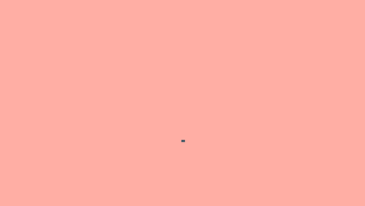
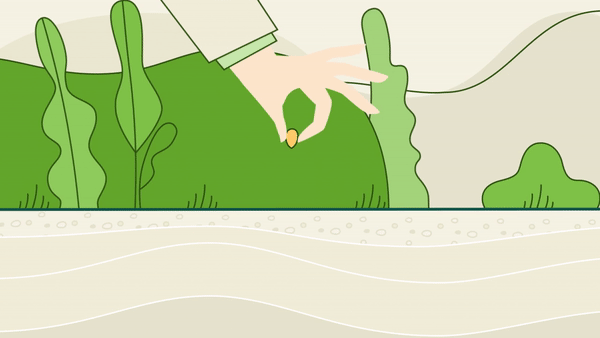
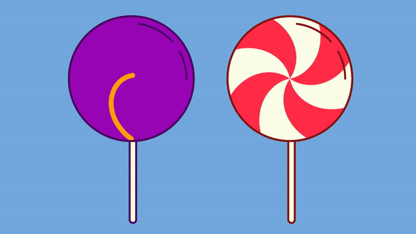
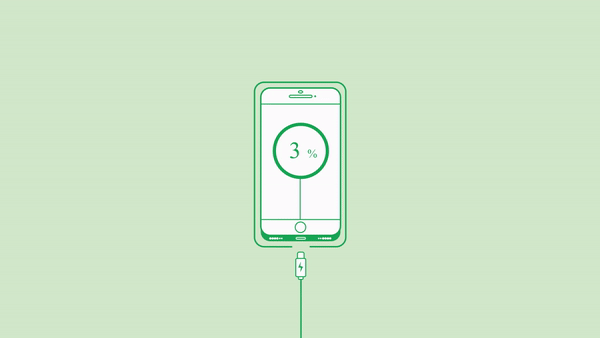

# 5. Shape Animation

### [24. Required Tools](<24. Required Tools>)

### [25. Creating Shapes](<25. Creating Shapes>)

## 

### [26. Fill and Stroke](<26. Fill and Stroke>)

### [27. Shape parameters](<27. Shape parameters>)

### [28. Stroke (Taper and Wave)](<28. Stroke (Taper and Wave)>)

## /Render/Boat_1.gif>)

## /Render/Cup.gif>)

### [29. Merge Paths Modifier](<29. Merge Paths Modifier>)

## 

### [30. Offset Paths](<30, Offset Paths>)

## 

### [31. Pucker_and_Bloat](<31. Pucker_and_Bloat>)

## 

### [32. Repeater](32._Repeater)

## 

## 

## 

## 

### [33. Round_Corner](33._Round_Corner)

## 

### [34. Trim Paths](34._Trim_Paths)

## 

### [36. Twist](36._Twist)

## 

### [36. Wiggle Paths](36._Wiggle_Paths)

## 

### [37. Wiggle_Transform](37._Wiggle_Transform)

## .gif>)

### [38. Zig Zag](<38. Zig Zag>)

## .mp4.gif>)
